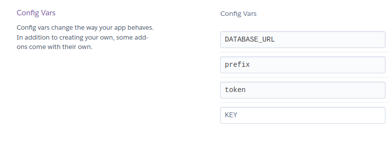
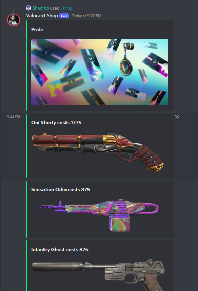

<center></center>

# 🔗| INVITE THE BOT
a ready made bot is already being hosted to test out! 

[check here](https://discord.com/api/oauth2/authorize?client_id=980918916211695717&permissions=139586816064&scope=bot%20applications.commands)

# ⚙️| SETUP

### Self-hosting
just put the details in `config/config.json`
```json
{
    "token" : "YOUR BOT TOKEN HERE",
    "prefix" : "/",
    "DATABASE_URL" : "Postgres_Database_Url_here",
    "guilds":[server IDS]
}
```

then run `main.py`

### Heroku 
A saperate branch for has been made for heroku [click here](https://github.com/typhonshambo/valo-shop/tree/heroku) to go there. Just download the code and push it in heroku all the dependencies are already setup.

`config vars`
```
token=your token
prefix=/
DATABASE_URL=your_postgresDB_url
```


# 📸| SCREENSHOTS


# ❓| HAVE ANY QUESTION?
join our discord server and ping me in chat, i will be happy to help you out :D

[](https://discord.gg/m5mSyTV7RR)

# 🙌| SUPPORT
- [x] Follow my github profile
- [x] Join our discord Server
- [x] Star this Repository
